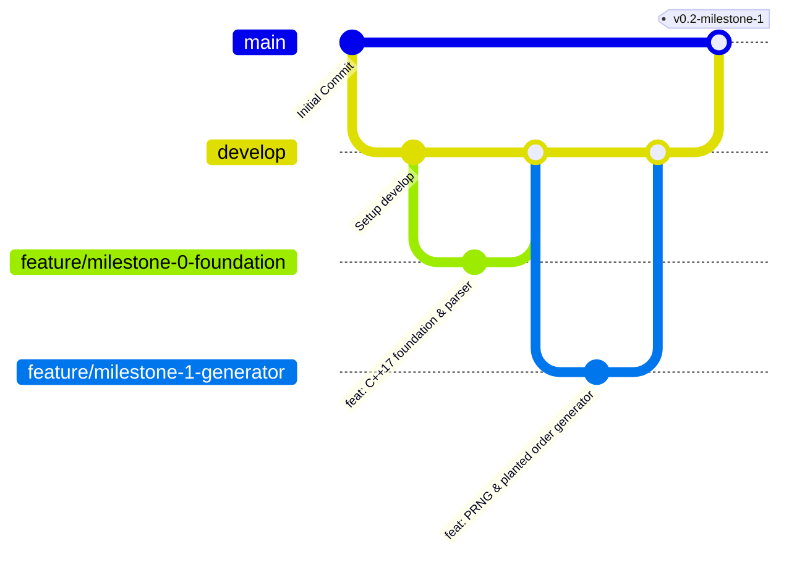

# ⚙️ Single-Machine Job Scheduling ("Chaîne Unique")

[](https://isocpp.org/)
[](https://cmake.org/)
[](#-the-4-scheduling-strategies)
[](#-validation--oracles)
[](#)

> **Single-machine job scheduling**: Scientifically comparing greedy heuristics and exact combinatorial algorithms to minimize financial late penalties and maximize on-time delivery under strict contractual deadlines.

---

## 🏭 Industrial Problem & Business Context

An industrial reprography and printing workshop operates an **inelastic, single-machine production line**:
* **Zero Parallelism**: Only one order can be processed on the chain at any given time.
* **Non-Preemptive**: Once a printing job starts, it cannot be interrupted or paused.
* **All-or-Nothing Penalty Model**: If a customer order finishes even **one minute late**, the full contractual penalty $w$ is owed immediately. A delay of 1 minute costs exactly the same as a delay of 1 month.

### 📉 The Problem with Current Operations
The workshop supervisor currently schedules jobs naively by **Earliest Due Date (EDD)**.  
When a massive job is scheduled first, it occupies the machine for too long, cascading delays onto dozens of quick, high-penalty jobs downstream and bleeding corporate cash.

### 🎯 Our Mission
Scientifically benchmark 4 decision rules, measure actual financial savings, automate verification with mathematical oracles, and deliver an **actionable 1-page executive memo** advising the workshop manager on the exact scheduling rule to deploy on Monday morning.

---

## 🔬 The 4 Scheduling Strategies

Every strategy shares an identical core backbone: **sort by deadline ($d$ ascending)**, step through time, and as soon as a deadline is missed, decide which job to sacrifice to save the rest:

| Strategy | Algorithmic Basis | Eviction Policy on Late Job | Optimization Target | Mathematical Guarantee |
| :---: | :--- | :--- | :--- | :--- |
| **`R1`** | **Naive Baseline** | **None** (suffer all cascading delays) | Pure deadline order | Current workshop reference |
| **`R2`** | **Moore-Hodgson (1968)** | Job with the **longest duration $p$** | Maximize on-time job count | **Proven Optimal** ($O(n \log n)$) |
| **`R3`** | **Penalty Greedy** | Job with the **smallest penalty $w$** | Minimize financial loss | Heuristic (no theoretical guarantee) |
| **`R3'`** | **Ratio Greedy** | Job with the **smallest ratio $w / p$** | Balance financial value vs occupied time | Advanced Heuristic |

> 📌 **Strict Tie-Breaking Rule**: When selecting a job to evict among equals, evict the one with the **largest duration $p$**; if still tied, evict the one that appears **furthest down in the source file**.

---

## 📂 Repository Structure

```text
ChaineUnique/
├── src/                      # C++17 source code (English identifiers & comments)
│   ├── order.hpp             # Core Order struct (p, d, w, original line, ratio)
│   ├── order_book_parser.hpp # Order file parser header
│   ├── order_book_parser.cpp # Order file parser implementation
│   └── main.cpp              # CLI entry point
├── carnets/                  # Order books (.txt), witness files, and trap instances
│   └── sample.txt            # Initial test instance
├── measures/                 # Statistical benchmarks & campaign CSV exports
├── docs/                     # Specifications, proofs, and project documentation
│   ├── project_plan.md       # Progressive implementation roadmap
│   ├── Chaîne Unique - new.pdf
│   └── Kickoff - Lancement.pptx.pdf
├── CMakeLists.txt            # CMake build configuration
├── Makefile                  # GNU Make build configuration
├── .gitignore                # Clean repository tracking
└── README.md                 # Primary project overview
```

---

## ⚡ Quick Start & Compilation

This project requires a standard **C++17** compiler (`g++`, `clang++`, or `MSVC`).

### Option A: Using CMake & Ninja (Recommended)
```bash
# Configure build
cmake -B build -G Ninja

# Compile project
cmake --build build

# Run executable
./build/chaine_unique carnets/sample.txt
```

### Option B: Using GNU Make
```bash
# Compile
make

# Run executable
./chaine_unique carnets/sample.txt
```

### Option C: Direct g++ Command
```bash
g++ -std=c++17 -Wall -Wextra -O3 -Isrc src/main.cpp src/order_book_parser.cpp -o chaine_unique
./chaine_unique carnets/sample.txt
```

---

## 💻 Sample CLI Output

```text
Loading order book from: carnets/sample.txt ...

========================================
        ORDER BOOK SUMMARY
========================================
 Total orders parsed : 5
 Total duration (p)  : 15 time units
 Total penalties (w) : 75 EUR
========================================

Line  ID          p (time)  d (deadline)w (penalty) Ratio (w/p)
--------------------------------------------------------------
3     JOB_A       3         5           10          3.33      
4     JOB_B       2         4           15          7.50      
5     JOB_C       4         7           20          5.00      
6     JOB_D       1         3           5           5.00      
7     JOB_E       5         12          25          5.00      
--------------------------------------------------------------
```

---

## 🌿 Git Branching Strategy & Workflow

To maintain clean and traceable code delivery across milestones, this repository follows a structured branching model:



* **`main`**: Protected production branch. Contains only validated, peer-reviewed releases and final deliverables.
* **`develop`**: Central integration branch for all completed milestones.
* **`feature/milestone-<N>-<topic>`**: Dedicated branches for each step:
  * `feature/milestone-0-foundation`: Data model, parser, build setups.
  * `feature/milestone-1-generator`: Custom 32-bit PRNG, planted solution, noise, ASCII timeline.
  * `feature/milestone-2-judge`: Feasibility judge (EDD) and formal exchange proof.
  * `feature/milestone-3-rules`: R1, R2 (Moore-Hodgson), R3, R3' implementations.
  * `feature/milestone-4-bound-exact`: Theoretical $k$-bound and exact combinatorial verifier ($N \le 18$).
  * `feature/milestone-5-oracles`: Automated test suite for the 5 fundamental invariants.
  * `feature/milestone-6-campaign`: Massive benchmarks (up to 2,000 orders) & CSV export.
  * `feature/milestone-7-adverse-memo`: Adversarial trap cases & 1-page executive memo.

---

## 📜 Full Project Roadmap

For the detailed breakdown of all milestones, deliverables, and proofs, see the complete project plan:  
👉 **[`docs/project_plan.md`](docs/project_plan.md)**
