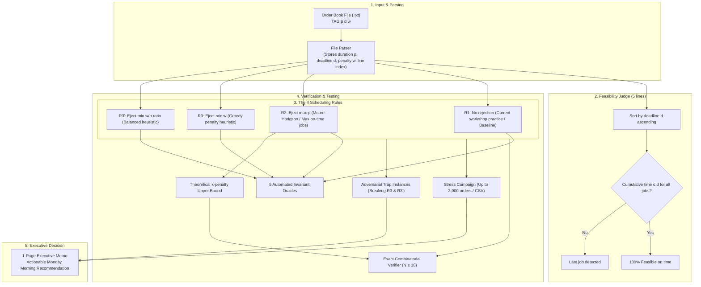

# 📋 Project Plan — Single-Machine Job Scheduling ("Chaîne Unique")

---

## 🎯 1. Simplified Business Context

In an industrial printing and binding workshop, there is **only one production line** (a single machine):
- **No parallelism**: The machine can only process one job at a time.
- **No preemption**: Once a job starts running, it cannot be interrupted or paused.

Each customer order is defined by three positive integers $(p, d, w)$:
1. **$p$ (Processing time)**: The duration required on the machine.
2. **$d$ (Deadline)**: The strict agreed delivery deadline with the customer.
3. **$w$ (Weight / Penalty)**: The financial penalty charged if the deadline is missed.

### ⚠️ The "All-or-Nothing" Contractual Rule
- If the order completes on time ($\text{end} \le d$): **$0$ penalty**.
- If it finishes even one minute late ($\text{end} > d$): **The full penalty $w$ is due immediately**. Being 1 minute late costs the exact same as being 1 month late.

### 📉 The Current Problem
The workshop supervisor currently schedules jobs naively by sorting them from the most urgent to the least urgent (earliest deadline $d$ first).  
As a result, long tasks block the machine, cascade delays onto subsequent orders, and cause massive financial losses.

### 🏆 Our Mission
Scientifically evaluate different decision rules, measure the actual money saved, and write a **one-page executive decision memo** recommending the best scheduling rule for the supervisor to implement on Monday morning.

---

## 🔍 2. Authoritative Answers to the 5 Framing Questions

Based on the project specifications and kickoff presentation:

| Framing Question | Official Specification Answer | Concrete Implementation Impact |
| :--- | :--- | :--- |
| **1. What happens to ejected jobs?** | An ejected job is removed from the active "on-time" schedule so it no longer delays subsequent jobs. It is deferred to the end of the day and counted as late (penalty $w$ paid). | It is removed from the active cumulative processing time. |
| **2. Language conventions** | The entire project (code, identifiers, comments, tests, README, proofs, and decision memo) is handled in **English** as requested. | Consistent English naming and documentation throughout. |
| **3. Tie-breaking rule** | If multiple candidates can be ejected: eject the one with the **largest duration $p$** first. If still tied, eject the one located **furthest down (highest line number) in the source file**. | Each job must record its `original_file_line` when parsed. |
| **4. Allowed tools vs external solvers** | External solvers (SCIP, OptaPlanner, HiGHS, LP/MIP solvers) are **strictly forbidden**. Standard language data structures (`std::priority_queue`, sorting functions, lists, heaps) are **explicitly allowed** (Slide 3). | Standard C++ STL containers are used directly. |
| **5. Completion time exactly equal to deadline** | If $\text{end} = d$, the order is **delivered on time without penalty** ($\text{end} \le d$). | Strict on-time condition: `current_time <= order.deadline`. |

---

## 🧩 3. Visual System Flowchart

---

## 🛠️ 4. The 4 Rules at a Glance

All four algorithms share the exact same algorithmic backbone: **sort by deadline ($d$ ascending)**, step forward accumulating execution time, and as soon as a delay is detected, decide which job to sacrifice:

| Rule | Description / Origin | Which job is ejected when a deadline is missed? | Target Objective | Mathematical Status |
| :---: | :--- | :--- | :--- | :--- |
| **R1** | Naive Baseline | **None** (suffer all cascading delays) | Pure deadline order | Baseline reference |
| **R2** | Moore-Hodgson (1968) | The job with the **longest duration $p$** | Maximize the count of on-time jobs | **Proven Optimal** ($O(n \log n)$) |
| **R3** | Penalty Greedy | The job with the **smallest penalty $w$** | Minimize financial penalties | Heuristic (no theoretical guarantee) |
| **R3'** | Ratio Greedy | The job with the **smallest ratio $w / p$** | Balance financial penalty against time occupied | Advanced Heuristic |

---

## 📅 5. Progressive Roadmap (Milestone by Milestone)

```mermaid
gantt
    title Progressive Implementation Roadmap
    dateFormat  X
    axisFormat  Milestone %s
    section Foundation
    Milestone 0 - Architecture & Parsing      :active, 0, 1
    Milestone 1 - Generator PRNG & ASCII Bar  : 1, 2
    section Core Algorithms
    Milestone 2 - Feasibility Judge & Proof   : 2, 3
    Milestone 3 - The 4 Rules (R1, R2, R3, R3') : 3, 4
    section Validation
    Milestone 4 - k-Bound & Exact Verifier    : 4, 5
    Milestone 5 - The 5 Automated Oracles     : 5, 6
    section Analysis & Report
    Milestone 6 - Benchmark Campaign (CSV)    : 6, 7
    Milestone 7 - Trap Instances & 1-Page Memo : 7, 8
```

---

### 🔹 Milestone 0: C++17 Foundation & Order Book Parser
- **Goal**:
  - Setup compilation via `Makefile` and `CMakeLists.txt` (C++17 with `g++`).
  - Define the `Order` struct (`id`, `duration_p`, `deadline_d`, `penalty_w`, `original_line`).
  - Build a clean file parser reading orders line-by-line while tracking original file line positions.
- **Deliverable**: An initial executable that loads any order file and displays its summary in memory.

---

### 🔹 Milestone 1: Order Generator & ASCII Timeline
- **Goal**:
  - Implement a 32-bit reproducible PRNG (e.g. Xorshift32 with an integer seed).
  - Implement the **solution planting technique**:
    - First generate a subset of orders guaranteed to be 100% on time by construction.
    - Save its exact size in an external witness file (`carnets/witness_*.txt`).
    - Add noise / parasitic orders with tight deadlines to saturate the machine.
    - Shuffle the order book.
  - Implement terminal visualization: **ASCII Timeline** for small books ($\le 60$ time units) and tabular display beyond.
- **Deliverable**: CLI tool capable of generating deterministic test books and witness files.

---

### 🔹 Milestone 2: Feasibility Judge & Exchange Proof
- **Goal**:
  - Implement `is_feasible(orders)` (compact logic): sort by $d$ ascending, accumulate processing times, check if cumulative time $\le d$.
  - Write formal proof demonstrating Jackson's Earliest Due Date (EDD) rule using an exchange argument.
- **Deliverable**: Standalone judge tool + mathematical proof in `docs/proof_feasibility.md`.

---

### 🔹 Milestone 3: The Four Decision Rules (R1, R2, R3, R3')
- **Goal**:
  - Implement the unified scheduling engine with the strict tie-breaking rule (largest $p$, then lowest source file line).
  - Implement R1, R2 (Moore-Hodgson using `std::priority_queue`), R3, and R3'.
  - Write formal proof of R2's optimality for on-time order volume.
- **Deliverable**: Core scheduling engine outputting for each rule: on-time jobs, paid penalties, and saved penalties.

---

### 🔹 Milestone 4: Theoretical Bound & Exact Combinatorial Verifier
- **Goal**:
  - Implement the **$k$-penalty theoretical bound** ($k$ from R2; max saved penalties = sum of $k$ highest $w$).
  - Implement an exact branch-and-bound combinatorial verifier (binary take-or-leave recursion) for small instances ($N = 16$ to $18$).
  - Measure the true optimality gap of heuristics R3 and R3'.
- **Deliverable**: Exact combinatorial solver to benchmark heuristics against absolute ground truth.

---

### 🔹 Milestone 5: The 5 Automated Oracles
- **Goal**:
  - Automate verification of the 5 required invariants:
    1. If all $w = 1$, then $\text{saved}(R2) == \text{saved}(R3)$.
    2. $\text{saved}(R1) \le \text{saved}(R2)$.
    3. $\text{saved}(R3) \le \text{saved}(R2)$.
    4. $\text{saved}(R2) \ge \text{planted count in witness file}$.
    5. For every rule: $\text{Penalties paid} + \text{Penalties saved} = \text{Total penalties}$.
- **Deliverable**: Automated test suite run with a single command (`make test`).

---

### 🔹 Milestone 6: Experimental Campaign (CSV Export)
- **Goal**:
  - Generate large-scale benchmarks (up to 2,000 orders) across 3 distinct data distributions:
    - Penalties independent of duration.
    - Penalties positively correlated with duration (heavy orders = high financial risk).
    - Penalties anti-correlated with duration (short tasks with huge penalties).
  - Run $\ge 50$ iterations per setting, calculate mean and worst-case performance.
  - Export structured results to `measures/campaign_results.csv`.
- **Deliverable**: Complete statistical dataset validating real-world performance.

---

### 🔹 Milestone 7: Adversarial Trap Instances & 1-Page Decision Memo
- **Goal**:
  - Construct the parameterized adversarial family against R3: 1 long task $A$ ($p=n, d=n, w=10$) blocking $n$ short tasks ($p=1, d=n+1, w=9$). Show R3 fails while R3' easily finds the optimum.
  - Construct/document the worst-case instance against R3'.
  - Draft the **1-page Executive Decision Memo** for the workshop manager (analyzing average gain vs worst-case catastrophe).
  - Complete the comprehensive project `README.md`.
- **Deliverable**: Final executive memo and complete project documentation.

---

## 🔒 6. Working Principles & Safety Rules
1. **Never confirm or proceed alone**: Every architectural choice and milestone transition requires your explicit validation.
2. **Never push alone**: No `git push` command will ever be run without your explicit go-ahead.
3. **Always propose clear options**: Every technical crossroads will be presented with straightforward pros and cons.
